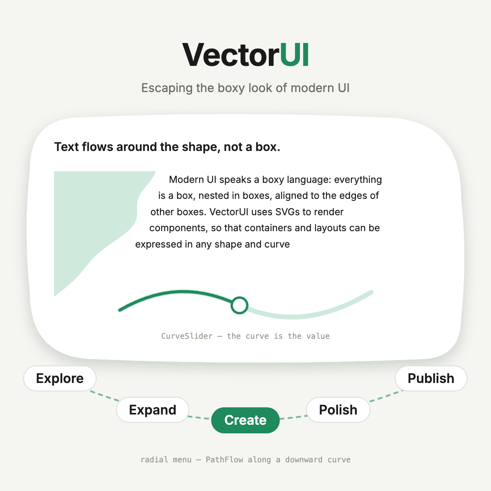

**A React UI component model rendered entirely in SVG — shapes and curves, not boxes.**

Modern UI speaks a boxy language: everything
is a box, nested in boxes, aligned to the edges of
other boxes. VectorUI uses SVGs to render
components, so that containers and layouts can be
expressed in any shape and curve.


📖 **[Developer Guide](./docs/guide.md)**. The API is small and stable enough to build with, and 148 unit tests cover the layout core — but it is not > production-hardened and **is not published to npm yet**. Run it from source
(below). Feedback and contributions are very welcome; see
[Contributing](#contributing).

#### ️[Try the live demo](https://samlee-dedeboy.github.io/VectorUI/) 

---
## Why

Rounded corners are the entire vocabulary CSS gives you for non-rectangular
layout. Anything beyond that — a paragraph hugging a curve, a menu fanned along
an arc, a slider whose *track* is the transfer function — is either a static
image or an absurd hack of absolutely-positioned slivers.

In SVG those are ordinary layout problems. VectorUI provides the missing
engine: text measurement that respects an arbitrary intrusion profile,
arc-length distribution along curves, shape-fit slots, path morphing across
breakpoints, and a direct-manipulation edit protocol — all as React components
with a coherent coordinate model.

## Quick start

```bash
git clone https://github.com/SamLee-dedeboy/VectorUI.git
cd VectorUI
npm install
npm run dev      # http://localhost:5181
```

Open the dev server and pick a demo. Every demo page has a **Demo / Code** tab —
"Code" shows the exact source that produced what you're looking at, imported
verbatim, so the result and the code that made it sit side by side.

### The hello world

```tsx
import { VectorUIRoot, Text, tokens } from "vectorui";

<VectorUIRoot width={320} height="content">
  <Text {...tokens.type.body} maxWidth={320} x={16} y={16} fill={tokens.color.ink}>
    Hello from an SVG document.
  </Text>
</VectorUIRoot>
```

Every tree is wrapped in a `VectorUIRoot` — it emits the `<svg>` and provides
the coordinate scale.

### The one that shows the point

Text flowing around a shape's real silhouette. One path declaration drives
*both* the drawn shape and the wrap contour, so the text provably hugs the
curve that's on screen:

```tsx
import { VectorUIRoot, WrapText, Float, tokens, cornerBlob } from "vectorui";

const blob = cornerBlob({ width: 168, height: 212 });

<VectorUIRoot width={760} height="content">
  <WrapText {...tokens.type.body} gap={24} fill={tokens.color.ink}>
    <Float d={blob.path} fill={tokens.color.accentSoft} />
    {BODY_TEXT}
  </WrapText>
</VectorUIRoot>
```

> Examples import from `"vectorui"` (the public barrel, `src/index.ts`). Inside
> this repo the demos use relative paths, since there's no published package
> yet.

## What you can build

Each item is a live demo — run `npm run dev` and open the route.

| | Demo | What it proves |
|---|---|---|
| 📝 | [`#/01-text-flow`](src/demos/01-text-flow) | **Text flows around a shape**, not a box — including *through* a concave archway, wrapped on both sides at once. |
| 🃏 | [`#/02-card`](src/demos/02-card) | **`Card` — shape as container.** Shape-as-prop plus contour-fit slots; one `Float` drawn, wrapped around, and filled inside. |
| 🌸 | [`#/03-radial-menu`](src/demos/03-radial-menu) | **`PathFlow` + `VectorButton`.** Curve as layout, path as button: arc-length distribution, tangent rotation, staggered fan-out. |
| 🎚️ | [`#/04-curve-slider`](src/demos/04-curve-slider) | **`CurveSlider` — the curve *is* the function.** A volume taper, a hike elevation, a full-circle clock. Pointer, keyboard, reduced-motion. |
| 〰️ | [`#/05-procedural-path`](src/demos/05-procedural-path) | **Procedural shapes with live reflow** — one closed-form function feeds both the silhouette and the paragraph, in lockstep, in one frame. |
| 🎬 | [`#/06-animation`](src/demos/06-animation) | **Animation as a render-time concern** — tween a child transform, a layout input, or a `shape` prop with the same recipe. |
| 📐 | [`#/07-breakpoint-morph`](src/demos/07-breakpoint-morph) | **Breakpoint shape-morph** — a card that blends blob↔rectangle as its container crosses a breakpoint band. |
| 🎛️ | [`#/08-layout-playground`](src/demos/08-layout-playground) | **The whole layout system in one knob-driven scene** — shrink-wrap, distribute, container queries, dynamic shapes. |
| ✋ | [`#/09-design-surface`](src/demos/09-design-surface) | **Direct manipulation.** Drags cascade *through* the layout (scoop → text rewrap → slot height → auto-size) instead of overriding it. |

There's also a **[Playground](docs/playground.md)** (`#/playground`) — a live
scratchpad backed by real files, editable from the browser or from your editor,
hot-reloading either way.

## The one concept to know

VectorUI works in **two coordinate spaces at once**:

- **Layout units** — positions, sizes, spacing, shapes, the `viewBox`. These
  scale with the viewport.
- **CSS pixels** — text size and stroke width. These must *not* scale
  uniformly, or body text would shrink to nothing on a small screen.

A single `scale` reconciles them and **the library applies it for you** — you
almost never touch it. Rule of thumb: `x`, `y`, `width`, `gap`, `padding` are
layout units; `font` and `lineHeight` are pixels. Need a label's width in
layout units? `useNaturalTextWidth` converts internally.

Full treatment in [guide §1](./docs/guide.md).

## Architecture

Three layers, strictly bottom-up. **Layers 1 and 2 never import tokens.**

| Layer | Path | Role |
|---|---|---|
| 1 — render primitives | `src/svg/` | Thin SVG wrappers: `Group`, `Path`, `Circle`, `TextLine`. No layout logic. |
| 2 — layout engine | `src/layout/` | Pure functions + hooks: coordinate scale, text measurement, flow-around, arc-length curves, path morphing, breakpoints, tweens, edit handles. |
| 3 — components | `src/components/` | `VectorUIRoot`, `Text`, `WrapText`, `Frame`, `Card`, `LandscapeCard`, `Flow`, `PathFlow`, `Pill`, `VectorButton`, `Float`, `CurveSlider`, `DesignSurface`. |
| tokens | `src/tokens/` | Design tokens — consumed at Layer 3 only. |
| shape kit | `src/shapes/` | Reusable shape providers: a path plus a matching `flowAround` profile. |

Most apps consume Layer 3 + tokens; Layers 1 and 2 are escape hatches. The
public API is the barrel at [`src/index.ts`](src/index.ts).

## Honest limitations

Useful when assessing whether this fits your project:

- **One-frame settle.** Content-sizing measures rendered bounds, so layout
  settles a frame after first paint. No visible flash, but it isn't synchronous.
- **`Text` takes a plain string.** No inline spans, bold runs, or links within a
  paragraph — mixed formatting means multiple `<Text>` elements.
- **`getBBox` ignores filter ink.** Keep a little padding around shadowed shapes.
- **Edit mode v1 is parameterised-only** — components opt in with control
  points; editing an arbitrary user-supplied `d` string is out of scope.
- **`Frame` slot geometry is still hand-coded** coordinates. `Flow` removes most
  of it, but anchor/region specs are manual.
- **Deferred:** Figma pipeline, full WCAG/keyboard nav, HTML-overlay text
  inputs, RTL, theming UI, SSR, performance work.

The full list, with detail, is [guide §16](./docs/guide.md).

## Contributing

Contributions are genuinely welcome — this is a prototype looking for real use,
and the fastest way to improve it is to try building something and report where
it fought you.

**Good places to start**

- **Build something and file the friction.** An issue that says "I tried to do
  X and had to reach for `scale`/hand-computed coordinates" is the single most
  valuable contribution.
- **Add a shape provider** in `src/shapes/` — a path plus its matching
  `flowAround` profile. Self-contained and unit-testable.
- **Take a limitation from the list above.** Inline text spans and `Frame` slot
  ergonomics are the two with the most leverage.
- **New demo or playground sketch** — demos are the de-facto consumer code and
  the integration tests.

**Ground rules**

1. **Layers 1 and 2 must not import tokens.** Tokens are Layer 3 only.
2. **Keep intrinsic geometry separable from viewport placement** — define a
   shape or sub-tree in its own local frame, then place it.
3. **Don't leak the coordinate model.** If consumer code has to divide by
   `scale`, that's a bug in the API, not in the consumer. Seal it behind an
   ergonomic prop or hook.
4. **Pure layout/shape functions get a unit test** under `tests/`.

**Before you open a PR**

```bash
npm run build    # tsc -b + production build
npm test         # vitest — 148 tests over the layout core
npm run dev      # verify the affected demos in the browser
```

Read [`docs/guide.md`](./docs/guide.md) first — it's the contract the whole
library is written against. [`CLAUDE.md`](./CLAUDE.md) is the short orientation
version. [`SPEC.md`](./SPEC.md) is the original design document, kept for
historical context.

## Project map

| Path | What |
|---|---|
| [`docs/guide.md`](./docs/guide.md) | The developer guide — start here. |
| [`docs/playground.md`](./docs/playground.md) | The live-sketch playground. |
| [`docs/edit-mode.md`](./docs/edit-mode.md) | The direct-manipulation protocol. |
| [`src/demos/`](./src/demos) | Nine demos + [their README](./src/demos/README.md). |
| [`tests/`](./tests) | Vitest — pure layout/shape functions. |
| [`eval/`](./eval) | Agent-authorability harness + visual baselines. |

## License

No license file yet — until one is added, default copyright applies and the
code is not licensed for reuse. If you'd like to use VectorUI, please
[open an issue](https://github.com/SamLee-dedeboy/VectorUI/issues) and a
license will be sorted out.
